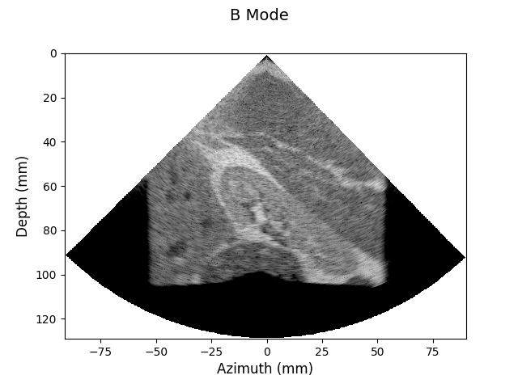

Field-II Examples
=================

[Field-II](http://field-ii.dk) is a program to simulate Ultrasound fields.
The program has several examples of phased array imaging.
One of the examples is the [kidney example](http://field-ii.dk/?examples/kidney_example/kidney_example.html).
In this repo, we try to construct a Python implementation of `calc_polar.m`.

## Current Status

`visualize.py` is able to construct a B-mode image using the `rf_data` found in Field-II website.
The image looks as follows:



To invoke the script:

  ```
  cd kidney
  ./visualize.py
  ```
